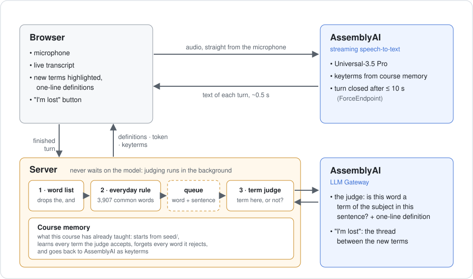

# Lecture Lens

**A voice agent that follows a lecture with you and tells you what you don't
know — while the lecturer is still talking.**

**Try it:** https://lecture-lens-vmam.onrender.com
(free hosting sleeps after 15 minutes; the first visit takes about a minute to wake it)

Built on AssemblyAI for the Voice Agent Hackathon, September 2026.

<!-- screenshot: docs/screenshot.png -->

---

## The problem

You are studying in a second language. The lecturer says a word you have never
met. By the time you have worked out whether it mattered, three sentences have
passed, and the rest of the lecture builds on the part you missed.

- **Subtitles** don't help: you heard the words.
- **Translation** doesn't help: the sentence wasn't the problem.
- **A recording** doesn't help: by then you are already behind.

You don't know which word you don't know until it is too late.

## What it does

| | |
|---|---|
| **Highlights what is new to this course** | Lecture Lens remembers every term the course has used. When the lecturer says one for the first time, it is highlighted in the transcript with a one-line definition. "New" means new *to this course* — not rare in English. |
| **Explains why you got lost** | The *I'm lost* button does not summarise — you heard the passage. It takes the terms that arrived in the last three minutes and explains the thread between them, and shows how dense that stretch was compared with the rest of the lecture. |
| **Hears the course better over time** | The terms the course has settled on are sent back to AssemblyAI, so the words your lecturer uses most are the ones the model listens for. |

Definitions are one line on purpose: anything longer costs the student the next
thirty seconds of the lecture, which is what the tool is supposed to save.

---

## How it works



### The life of one word

Follow the word `malloc` from the moment the lecturer says it.

1. **Sound becomes text.** The browser streams the microphone straight to
   AssemblyAI — our server never sees the audio. About half a second later the
   text comes back. To talk to AssemblyAI without our API key, the browser uses
   a short-lived token the server hands out.
2. **The turn closes.** AssemblyAI splits speech into turns. A turn ends when
   the lecturer pauses — or after ten seconds if they don't (`ForceEndpoint`).
   The browser sends the finished turn to our server.
3. **Three filters.** Every word the course has never heard goes through three
   filters, cheapest first:

   | filter | what it does | `malloc` |
   |---|---|---|
   | 1. word list | drops short and function words (*the*, *and*) | passes |
   | 2. everyday rule | drops the 3,907 most common English words (*make*, *call*) — unless the course declares one as its own term, like `free` | passes: it is rare |
   | 3. term judge | an LLM reads the word **and the sentence it was said in**: is this a term of the subject here? If yes, it writes the one-line definition in the same answer | *allocates memory on the heap* |

4. **Nothing waits for the model.** The server answers the browser at once and
   puts `malloc` in a queue. A background worker sends the queue to the judge
   every two seconds; the browser picks up the definition a moment later. The
   transcript never slows down because of the judge.
5. **The course remembers.** `malloc` is now a known term: highlighted once,
   defined once, never "new" again in this course.

### What else happens

- **Rejected words are forgotten.** If the judge says a word is ordinary, it is
  removed from the course memory. Otherwise it would be sent to AssemblyAI as a
  keyterm, and ordinary words in that list make recognition worse.
- **The course memory improves recognition.** On every connection the browser
  sends AssemblyAI the terms the course already knows (`keyterms_prompt`). That
  is how `scanf` stopped being heard as "scanner".
- **The course starts with a memory.** `seed/` holds what the course covered
  before today — lecture 1 knows `printf` and `scanf`, so they are not new. It is
  planted on a fresh server and never overwrites what the course has learned.
- **A dropped connection doesn't stop the lecture.** The browser gets a new
  token, fetches the current keyterms and reconnects without turning off the
  microphone, waiting 1, 2, 4, 8, then 15 seconds between tries.

### AssemblyAI features used

| feature | what it is for |
|---|---|
| Universal-3.5 Pro streaming | live transcript, ~0.5 s from speech to text |
| temporary tokens | the browser streams directly; the API key never leaves the server |
| `keyterms_prompt` | the course memory primes recognition of the course's own terms |
| `language_codes` | pins the lecture language, so the model does not drift into another one |
| `max_turn_silence` | tuned for a lecturer who hardly pauses |
| `ForceEndpoint` | caps a turn at ten seconds, so definitions arrive seconds after the word |
| LLM Gateway | the term judge, and the *I'm lost* explanation |

---

## Measured results

Every number here comes from a real recording, and the tools that produced it
are in `src/`.

### Speed

Speech to text, measured against the audio timeline (the comment in
`src/stream.py` explains why the obvious method gives a wrong answer):

| | terminal client | browser |
|---|---|---|
| median | 262 ms | 380–620 ms |
| 95th percentile | 463 ms | — |

From the word being said to its definition on screen: a few seconds, up to
about 40 when the gateway rate limit kicks in (see Limitations). Before
`ForceEndpoint` it could be more than a minute.

### Recognition

The same recording run twice, the only difference being the course memory sent
as keyterms:

```
without:  Still many of you does not finish the scanner.
with:     Still many of you does not finish the scanf.
```

`scanf` was heard as "scanner", "scan app" and "scanned" seven times across the
lecture. With the course memory, it was recognised every time.

### Filtering out noise

The hard part is not finding rare words — it is not highlighting the rare words
that are *not* terms. Three steps got us there:

**1. A rule for everyday words.** Replaying real lecture speech with the model
told to accept *everything* (the worst case): 43 highlights without the rule,
18 with it, all 5 real C terms kept.

**2. A judge that reads the sentence.** The noise that was left was rare
*ordinary* English — `dichotomy`, `hereafter`. Those words are exactly as rare
as the terms (word frequency 2.4–4.3 against 1.4–4.2 for `decimal`, `syntax`,
`heap`), so no rule can separate them. The sentence can. On 35 words from real
lectures, each judged in three different batch orders (`src/bench_judge.py`):

| the judge sees | real terms lost (of 14) | noise let through (of 19) |
|---|---|---|
| the word | 0.0 | 16.3 |
| the word and its sentence | 0.3 | 3.0 |

We wrote the bar down before the first run: ship only if no term is lost. The
sentence judge lost `decimal` once in three orders, so by our own rule it should
not have shipped. We shipped it anyway, knowingly: thirteen false highlights in
nineteen cost a student more attention than one missed term in forty-two
verdicts, and the missed term is still in the transcript.

**3. A live lecture.** Sixteen minutes of a CS50 lecture on memory in C,
streamed through the browser, starting from a memory that holds only lecture 1:

| | |
|---|---|
| words the judge was asked about | 114 |
| rejected as ordinary or misheard | 80 |
| highlighted | 29 |
| of those, real terms | 17 |

We also counted the terms in those sixteen minutes by hand, without looking at
the tool: **24. Lecture Lens got 18** — highlighted, or already known from
lecture 1. Each of the six misses has a known cause, listed under Limitations.
The ones that passage is about — `pointer`, `dereference`, `address-of`,
`hexadecimal`, `byte` — were all caught.

### Bugs this run found

Two, both fixed from its data:

- The model sometimes said "no" as a phrase — *"not a C programming term"* — and
  five rejected words were shown with that as their definition.
- A lecturer who never pauses produced turns of 60–80 seconds, so a definition
  arrived a minute after the word. `ForceEndpoint` now closes a turn after ten;
  on the run we checked, the noise stayed at the same level.

---

## How we tested it

### 114 automated tests

```
python -m pytest
```

Under a second, no network: the model is replaced by a stand-in that answers
exactly as each test instructs. Most tests are named after a bug that actually
shipped. Three of them are the same bug in three places — "judged and rejected"
treated as "never judged", which silently lost terms — and that is why the
suite exists.

### Testing the tests

A test that passes whether or not the bug is there is worse than no test. So for
the key fixes we put the bug back on purpose and checked that the suite fails:

| bug put back | tests that caught it |
|---|---|
| the queue stops passing the sentence to the judge | 2 |
| a retry after a failure forgets the sentence | 1 |
| sentences split at every dot (`stdio.h`, `0x1F`) | 1 |
| a word glued to a dot loses its sentence | 1 |
| the judge ignores the sentence it was given | 2 |
| "not a C programming term" read as a definition | 5 |

### A real-speech test bench

Chrome can use an audio file as its microphone, which turns any lecture
recording into a repeatable test: the same input every run, so every change can
be compared with what came before.

```
python src/convert.py lecture.mp3 --start 00:05:00 --duration 25:00 -o samples/bench.wav
```

Then start Chrome with the file as its microphone (Windows PowerShell):

```
& "C:\Program Files\Google\Chrome\Application\chrome.exe" --user-data-dir="$env:TEMP\ll-bench" --use-fake-ui-for-media-stream --use-fake-device-for-media-stream --use-file-for-fake-audio-capture="C:\full\path\samples\bench.wav" http://localhost:8000
```

The separate `--user-data-dir` matters: without it Chrome hands the command to a
Chrome that is already running, and silently drops the flags.

We started on synthetic speech and moved off it: a text-to-speech voice caused
mishearings and a drift into Hindi that real speech never did. Every result above
is from real speech.

### Tools

| tool | what it answers |
|---|---|
| `src/bench_judge.py` | does a judge change help? 35 labelled words, three orders, a decision rule printed with the numbers |
| `src/compare_prompt.py` | several prompt versions side by side on the same words |
| `src/debug_prompt.py` | one prompt, the raw reply, and what the parser made of it |
| `src/check_gateway.py` | which gateway models this API key can use |
| `src/stream.py` | terminal client: streaming, latency, transcript capture |

---

## Run it yourself

Requires Python 3.11+ and an AssemblyAI API key
([get one here](https://www.assemblyai.com/dashboard/api-keys)).

**Windows (PowerShell)**

```
git clone https://github.com/Giochvanno/hackathon-assemblyai.git
cd hackathon-assemblyai
python -m venv .venv
.venv\Scripts\activate
pip install -r requirements-dev.txt
copy .env.example .env
```

**macOS / Linux**

```
git clone https://github.com/Giochvanno/hackathon-assemblyai.git
cd hackathon-assemblyai
python -m venv .venv && source .venv/bin/activate
pip install -r requirements-dev.txt
cp .env.example .env
```

Put your key in `.env`, then start the server:

```
cd src
uvicorn server:app --port 8000
```

Open http://localhost:8000 and press **Start listening**. Wait for "listening"
before you speak. Browsers only allow the microphone on localhost or HTTPS.

**Deploying:** `render.yaml` deploys to Render's free tier. Set
`ASSEMBLYAI_API_KEY` in the Render dashboard — never in the file.

### Project layout

```
src/
  server.py           tokens, course memory, the judging worker, "I'm lost"
  glossary.py         the course memory: what this course has already taught
  terms.py            the term judge, via the LLM Gateway
  lost.py             "I'm lost": the thread between the terms that just arrived
  seed.py             build a course's starting memory
  stream.py           terminal client
  convert.py          any recording to 16 kHz mono WAV
  bench_judge.py      judge benchmark on real-speech words
  compare_prompt.py   prompt versions side by side
  debug_prompt.py     one prompt, its reply, and the parse
  check_gateway.py    which gateway models the key can reach
  candidates.py       transcript analysis from the first experiments
web/index.html        the browser client
seed/                 the course memory it starts with, and its declared terms
data/                 the everyday-English word list
tests/                the test suite
docs/                 the architecture diagram
```

---

## Limitations

**The judge**

- **It is a 4B-parameter model** — the only one this account can reach on the
  gateway. Its verdicts depend on which other words share the batch, and it
  lost `decimal` in one order of three on the benchmark.
- **Some rare ordinary words still get through** — 3 of 19 on the benchmark,
  about a dozen in a 25-minute live lecture (`glean`, `newfound`, `uppercase`).
  Their definitions are correct plain English, which helps a student reading in
  a second language, but they are not terms. Rules cannot remove them: the
  obvious one, stripping endings back to an everyday word, removes `simpler` and
  also `pointer`.
- **A word is judged once per course**, by the first sentence it was heard in.
  A term mentioned in passing can be rejected for good.
- **The gateway rate-limits this account.** On a 25-minute lecture, 15–24 of
  the judge's requests had to wait 6–30 seconds. The word still gets its
  definition, later. Batching longer would avoid the waits but make every
  definition slower, so we left it.

**What never becomes a candidate**

- Words under four letters (`int`, `RGB`), symbols (`%p`), numbers (`0x123`).
- Everyday words the course has not declared (`memory`, `main`) — one line in
  `seed/<course>.terms.txt` fixes that for a course.
- Multi-word terms are split: "segmentation fault" becomes two entries.

**Speech**

- **Language is a bias, not a lock.** On synthetic speech the model drifted into
  Hindi after about seven minutes despite `language_codes`. It never did on real
  speech.
- **Some errors no memory can fix.** "answer the question" came out as "menu
  and serve question" — ordinary words, mangled by accent and distance.
- **The course memory learns from the transcript.** A repeated mishearing could
  settle in and be reinforced through keyterms. The judge rejects most of them
  ("ZStack" for "the stack"), but not all.
- **A ten-second turn can end mid-sentence.** The judge then sees half a
  sentence, and the paragraph break falls where the timer fell.
- The first one to three seconds after *Start* are lost while the socket opens.

**The app**

- **The course is set in the page.** `COURSE` and `SUBJECT` at the top of
  `web/index.html` choose it; the server handles any number of courses, but
  there is no screen for choosing one yet.
- **Reconnection was tested by dropping a simulated socket** in a headless
  browser, not a real network failure.
- **Hosting:** on the free tier the disk is wiped on every restart — the seed is
  always there, anything learned since is not. One process, no login: anyone
  with the URL writes to the course memory.

## Next

- **A second lane for words, not terms.** The rare ordinary words the judge
  lets through are exactly what a student reading in a second language needs.
  Kept apart from the terms, they stop being noise.
- **A stronger judge.** Most limitations above that name the judge come back to
  a 4B model. Swapping it is one line in `src/terms.py`, and
  `src/bench_judge.py` says whether the new one is better.
- **Choosing the course on the page**, and a memory per student instead of per
  server.

## License

MIT — see `LICENSE`.
